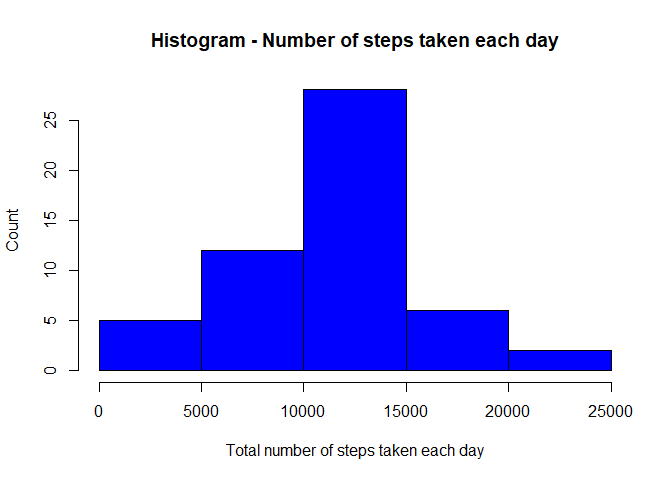
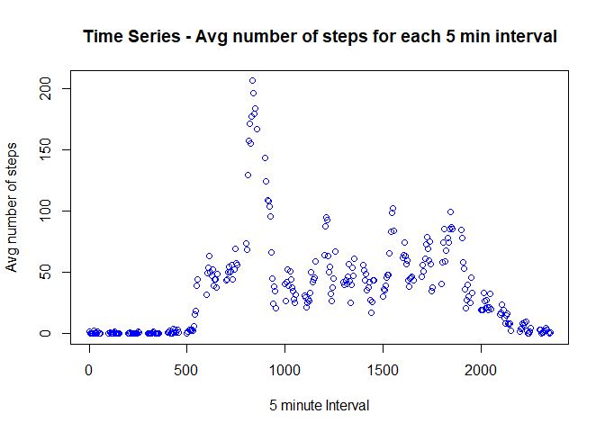
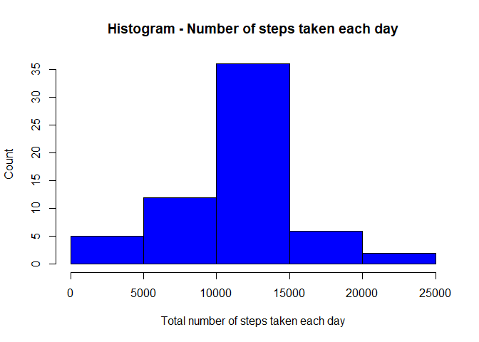

## Loading and preprocessing the data

1. Load the data (i.e. `read.csv()`)

2. Process/transform the data (if necessary) into a format suitable for your analysis


```r
if(!file.exists("activity.zip"))
  download.file("https://d396qusza40orc.cloudfront.net/repdata%2Fdata%2Factivity.zip", "activity.zip")

if (!file.exists("activity.csv"))
  unzip("activity.zip")

data <- read.csv("activity.csv")
```


## What is mean total number of steps taken per day?

1. Make a histogram of the total number of steps taken each day

2. Calculate and report the **mean** and **median** total number of steps taken per day


```r
stepsByDay <- aggregate(data["steps"], by=data["date"], sum)

meanSteps <- format(mean(stepsByDay$steps, na.rm="TRUE"), scientific = FALSE)

medianSteps <- median(stepsByDay$steps, na.rm=TRUE)

hist(stepsByDay$steps,
     xlab = "Total number of steps taken each day",
     ylab = "Count",
     main = "Histogram - Number of steps taken each day",
     col = 4)
```

<!-- -->

The mean total number of steps taken each day is 10766.19 and the median number of steps taken each day is 10765.


## What is the average daily activity pattern?


```r
## Get the avg numbers of steps taken for each 5 min interval

## One way to accomplish this is to use dplyr and group_by followed by summarize
stepsByIntveral <- data %>% group_by(interval) %>% summarize(avgSteps = mean(steps, na.rm = TRUE))

## Another way to accomplish this is to use the R Base function aggregate
stepsByInterval1 <- aggregate(x=list(steps = data$steps), by=list(interval = data$interval), FUN = mean, na.rm=TRUE)


## plot the time series of the avg number of steps taken per 5 min interval
plot(stepsByIntveral$interval, stepsByIntveral$avgSteps,
     xlab = "5 minute Interval",
     ylab = "Avg number of steps",
     main = "Time Series - Avg number of steps for each 5 min interval",
     col = 4)
```

<!-- -->

```r
maxInterval <- stepsByIntveral[which.max(stepsByIntveral$avgSteps),]
```

1. Make a time series plot (i.e. `type = "l"`) of the 5-minute interval (x-axis) and the average number of steps taken, averaged across all days (y-axis)

2. Which 5-minute interval, on average across all the days in the dataset, contains the maximum number of steps?

The following interval, averaged across all days, contains the maximum number of steps 835, 206.1698113.


## Imputing missing values

Note that there are a number of days/intervals where there are missing
values (coded as `NA`). The presence of missing days may introduce
bias into some calculations or summaries of the data.


```r
numNas <- sum(is.na(data$steps))
```
The number of rows with missing values in the dataset is 2304.


```r
## Strategy for imputing missing values 
## Use the mean for the 5 minute interval if the value is missing

fillValue <- function(steps, interval){
    filled <- NA
    if (!is.na(steps))
        filled <- c(steps)
    else
        filled <- (stepsByInterval1[stepsByInterval1$interval==interval, "steps"])
    return(filled)
}

filledData <- data
filledData$steps <- mapply(fillValue, filledData$steps, filledData$interval)

totalStepsByDay <- tapply(filledData$steps, filledData$date, FUN=sum)

hist(totalStepsByDay,
     xlab = "Total number of steps taken each day",
     ylab = "Count",
     main = "Histogram - Number of steps taken each day",
     col = 4)
```

<!-- -->

```r
meanSteps <- format(mean(totalStepsByDay, scientific = FALSE))

medianSteps <- format(median(totalStepsByDay, scientific = FALSE))
```

When imputing the missing values, the mean of steps taken each day is 10766.19 and the median number of steps taken is 10766.19. The mean value is slightly higher when imputing values because the total number of steps each day increases when NA values are replaced.

## Are there differences in activity patterns between weekdays and weekends?


```r
#we can use R's weekdays() function to determine if a given date is a weekday or weekend
#The weekday() method takes a date and returns a string value for the day of the week.

weekDayOrWeekend <- function(date) {
  day <- weekdays(date)
  if (day %in% c("Monday", "Tuesday", "Wednesday", "Thursday", "Friday"))
    return("weekday")
  else if (day %in% c("Saturday", "Sunday"))
    return("weekend")
  else
    stop("invalid date")
}

# Convert date column to date value
filledData$date <- as.Date(filledData$date)
filledData$day <- sapply(filledData$date, FUN = weekDayOrWeekend)

meanStepsByInterval <- aggregate(filledData$steps, list(filledData$interval, filledData$day), FUN="mean")

names(meanStepsByInterval) <- c("interval", "weekDays", "avgSteps")

xyplot(meanStepsByInterval$avgSteps ~ meanStepsByInterval$interval | meanStepsByInterval$weekDays,
       layout = c(1,2), type="l", xlab="Interval", ylab="Number of steps")
```

<!-- -->
